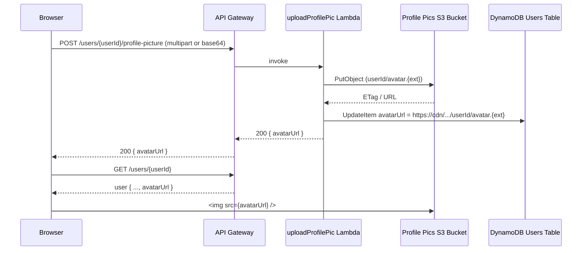

# Design: User Profile Picture

## Overview

This feature adds profile picture support to the micro-blogging app. Users can upload an image on their Profile page, which is stored in S3 and referenced by URL in DynamoDB. That URL is then displayed as an avatar next to posts in the Feed and at the top of the Profile page.

The `avatarUrl` field already exists on the `User` type and is an allowed field in `updateProfile.js`, so the DynamoDB schema requires no migration — only a new S3 bucket and a dedicated upload endpoint are needed.

## Architecture



Key design decisions:
- Images are served directly from S3 via a public-read bucket policy (or a dedicated CloudFront distribution behavior). No signed URLs are needed — profile pictures are public by nature.
- The upload Lambda receives the image as a base64-encoded body (JSON `{ "image": "<base64>", "contentType": "image/jpeg" }`). This avoids multipart parsing complexity in Lambda and stays within the 6 MB API Gateway payload limit (sufficient for avatar-sized images).
- The S3 key is `avatars/{userId}` (no extension) with the correct `ContentType` set on the object. Overwriting the same key on re-upload means no cleanup is needed.
- The CloudFront distribution already exists for the frontend bucket. A separate S3 bucket for avatars is added with a public-read bucket policy so `avatarUrl` values are stable, permanent HTTPS URLs.

## Components and Interfaces

### New Lambda: `uploadProfilePic`

**Path:** `backend/src/functions/users/uploadProfilePic.js`

```
POST /users/{userId}/profile-picture
Authorization: Bearer <token>
Content-Type: application/json

{
  "image": "<base64-encoded bytes>",
  "contentType": "image/jpeg" | "image/png" | "image/webp" | "image/gif"
}
```

Response:
```json
{ "avatarUrl": "https://<bucket>.s3.<region>.amazonaws.com/avatars/<userId>" }
```

The handler:
1. Validates the authenticated user matches `{userId}` (same ownership check as `updateProfile`)
2. Validates `contentType` is one of the allowed MIME types
3. Validates decoded image size ≤ 5 MB
4. Calls `S3Client.PutObject` with key `avatars/{userId}`, `ContentType`, and `Body`
5. Constructs the public URL and calls `DynamoDBDocumentClient.UpdateCommand` to set `avatarUrl`
6. Returns `{ avatarUrl }`

Environment variables injected by CDK: `PROFILE_PICS_BUCKET`, `USERS_TABLE`

### Updated: `getProfile` / `updateProfile`

No logic changes needed. `avatarUrl` is already returned by `getProfile` and is already in the `allowedFields` list in `updateProfile`.

### Frontend: `ProfilePictureUpload` component

**Path:** `frontend/src/components/ProfilePictureUpload.tsx`

Props:
```ts
interface ProfilePictureUploadProps {
  currentAvatarUrl?: string;
  userId: string;
  onUploadSuccess: (newAvatarUrl: string) => void;
}
```

Renders a circular avatar image (or placeholder initials) with an "Edit" overlay button visible on hover. Clicking opens a hidden `<input type="file" accept="image/*">`. On file selection, the component reads the file as base64 and calls `usersApi.uploadProfilePicture`.

### Frontend: `Avatar` component

**Path:** `frontend/src/components/Avatar.tsx`

Props:
```ts
interface AvatarProps {
  avatarUrl?: string;
  displayName: string;
  size?: 'sm' | 'md' | 'lg';  // 32px | 48px | 96px
}
```

Renders `` when `avatarUrl` is set, otherwise renders a `<div>` with the first letter of `displayName` as a fallback. Used in Feed post cards and Profile header.

### Updated: `api.ts`

New method added to `usersApi`:
```ts
uploadProfilePicture: async (
  userId: string,
  imageBase64: string,
  contentType: string,
  token: string
): Promise<{ avatarUrl: string }>
```

### Updated: `Feed.tsx`

Post cards gain an `<Avatar>` component next to the author's display name link.

### Updated: `Profile.tsx`

Profile header gains `<ProfilePictureUpload>` (own profile) or `<Avatar size="lg">` (other profiles).

## Data Models

### DynamoDB Users Table

No schema migration required. The `avatarUrl` attribute is already supported as an optional string field. It will be populated by the new upload endpoint.

| Attribute   | Type   | Notes                                      |
|-------------|--------|--------------------------------------------|
| id          | String | Partition key (unchanged)                  |
| username    | String | (unchanged)                                |
| displayName | String | (unchanged)                                |
| bio         | String | Optional (unchanged)                       |
| avatarUrl   | String | Optional HTTPS URL — already exists        |
| ...         | ...    | All other fields unchanged                 |

### S3 Bucket: Profile Pictures

| Property        | Value                                      |
|-----------------|--------------------------------------------|
| Bucket name     | CDK-generated (referenced via env var)     |
| Key format      | `avatars/{userId}`                         |
| ACL / Access    | Public read via bucket policy              |
| Content-Type    | Set per object (jpeg/png/webp/gif)         |
| Versioning      | Disabled (overwrite on re-upload)          |
| Removal policy  | DESTROY (dev)                              |

### TypeScript `User` type (frontend)

Already has `avatarUrl?: string` — no changes needed.


## Correctness Properties

*A property is a characteristic or behavior that should hold true across all valid executions of a system — essentially, a formal statement about what the system should do. Properties serve as the bridge between human-readable specifications and machine-verifiable correctness guarantees.*

### Property 1: Upload round-trip

*For any* valid user and valid image payload, uploading a profile picture and then fetching that user's profile should return an `avatarUrl` equal to the URL returned by the upload response.

**Validates: Requirements 1.1, 1.2**

### Property 2: Ownership enforcement

*For any* two distinct user IDs, authenticating as user A and attempting to upload a profile picture for user B should always result in a 403 response, regardless of the image content.

**Validates: Requirements 1.3**

### Property 3: Invalid content type rejection

*For any* MIME type string that is not one of `image/jpeg`, `image/png`, `image/webp`, or `image/gif`, the upload handler should reject the request with a 400 error. Edge case: payloads exceeding 5 MB should also be rejected.

**Validates: Requirements 1.4, 1.5**

### Property 4: Re-upload overwrites previous avatar

*For any* user, uploading a profile picture twice in sequence should result in the user's `avatarUrl` reflecting only the second upload — the first URL should no longer be the stored value.

**Validates: Requirements 1.6**

### Property 5: Avatar component rendering

*For any* combination of `avatarUrl` and `displayName`, the `Avatar` component should render an `` element when `avatarUrl` is a non-empty string, and a text fallback containing the first character of `displayName` when `avatarUrl` is absent. Edge case: when `avatarUrl` is undefined or empty string, the fallback must always be shown.

**Validates: Requirements 1.7, 1.8**

## Error Handling

| Scenario | HTTP Status | Response |
|---|---|---|
| Authenticated user ≠ path `{userId}` | 403 | `{ message: "You can only update your own profile" }` |
| Missing or invalid `contentType` | 400 | `{ message: "Unsupported content type" }` |
| Decoded image exceeds 5 MB | 400 | `{ message: "Image too large. Maximum size is 5MB" }` |
| Missing `image` field in body | 400 | `{ message: "Missing image data" }` |
| Invalid base64 encoding | 400 | `{ message: "Invalid image data" }` |
| S3 PutObject failure | 500 | `{ message: "Failed to store image" }` |
| DynamoDB UpdateItem failure | 500 | `{ message: "Failed to update profile" }` |
| User not found in DynamoDB | 404 | `{ message: "User not found" }` |

Frontend error handling:
- Upload failures surface as an inline error message below the upload control
- The avatar `` element uses an `onError` handler to fall back to the initial-based placeholder if the S3 URL becomes unreachable

## Testing Strategy

### Unit tests (Jest / Vitest)

Focus on specific examples, edge cases, and integration points:

- `uploadProfilePic` handler: ownership check returns 403 for mismatched userId
- `uploadProfilePic` handler: rejects each unsupported MIME type individually
- `uploadProfilePic` handler: rejects payload where decoded size > 5 MB
- `uploadProfilePic` handler: constructs correct S3 key (`avatars/{userId}`)
- `Avatar` component: renders `` with correct `src` when `avatarUrl` is provided
- `Avatar` component: renders initial fallback when `avatarUrl` is undefined
- `ProfilePictureUpload` component: file input triggers base64 conversion and API call

### Property-based tests

Use **fast-check** (frontend, TypeScript) and **fast-check** or **@fast-check/jest** (backend, Node.js).

Each property test must run a minimum of **100 iterations**.

Tag format: `// Feature: user-profile-pic, Property {N}: {property_text}`

| Property | Test description |
|---|---|
| Property 1 | Generate arbitrary valid image buffers + userId; upload then getProfile; assert `avatarUrl` matches |
| Property 2 | Generate arbitrary pairs of distinct userIds; upload as userA for userB; assert 403 |
| Property 3 | Generate arbitrary MIME type strings not in the allowed set; assert 400 |
| Property 4 | Generate arbitrary userId + two distinct image buffers; upload both; assert final `avatarUrl` matches second upload |
| Property 5 | Generate arbitrary `avatarUrl` (string or undefined) + `displayName`; render `Avatar`; assert correct element type |

Each correctness property must be implemented by a **single** property-based test referencing the property number in a comment.
